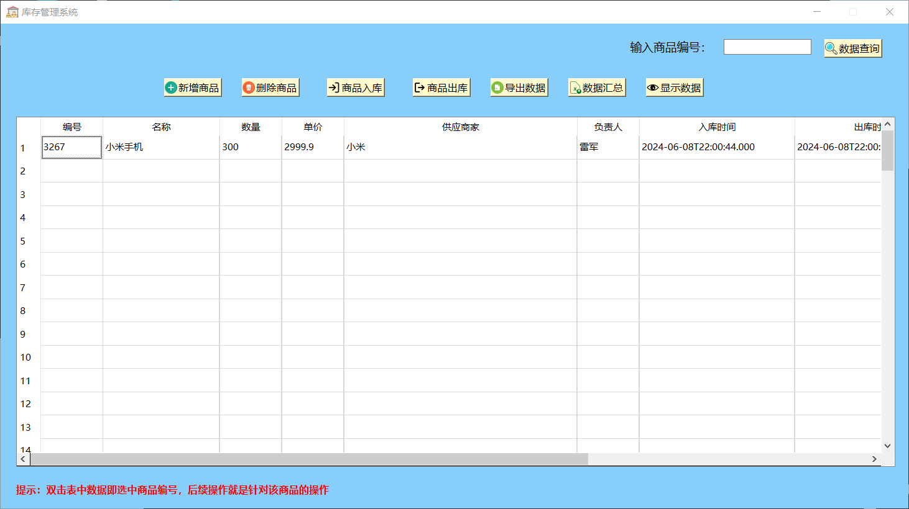

Windows ODBC连接MySQL数据库，记得导入sql文件

下面是你在代码中需要修改为你数据库情况的地方

```C++
void MainWidget::initSql() {
  if (!m_db->connectDb("root", "root", "127.0.0.1", "warehouse")) {
    QMessageBox::information(this, "提示", "连接失败");
  }
}
```

Clion开发整个项目，Cmkae管理整个项目（Qt Creator同样支持，到时候导入编译即可）

